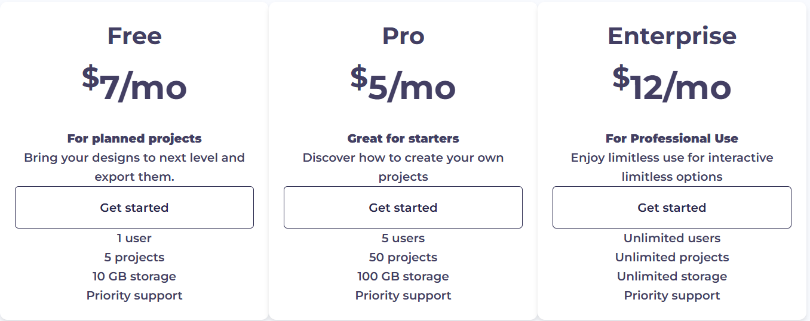

# Modern HTML CSS From The Beginning Course 🎓  
Welcome to the repository for [Modern HTML & CSS From The Beginning 2.0]! This repository contains multiple projects that demonstrate various concepts learned throughout the course.

## Table of Contents 📚  
Project 1: Pricing Card  
Project 2: Lumina Creative Website  
Project 3: Bono App  

---

## Project 1: Pricing Card 💳  

Live URL: [View Project 1 Live](https://pricing-card-e0e6dc.netlify.app/)
GitHub Repo: Project 1 Repository

---

## Project 2: Lumina Creative Website 💻  
_Project 2 Screenshot_

Live URL: View Project 2 Live  
GitHub Repo: Project 2 Repository

---

## Project 3: Bono App 🧩  
_Project 3 Screenshot_

Live URL: View Project 3 Live  
GitHub Repo: Project 3 Repository

---

## License  
This repository is for educational purposes as part of the **Modern HTML & CSS** course. You are free to use the code in your personal or academic projects.
