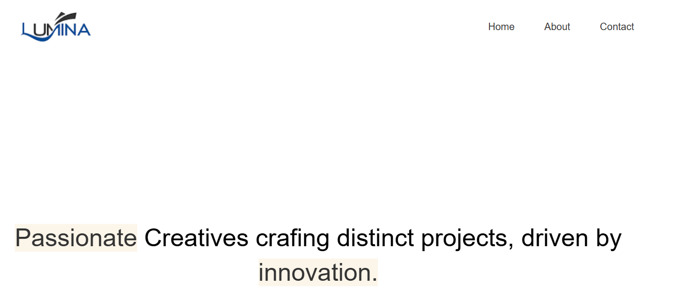
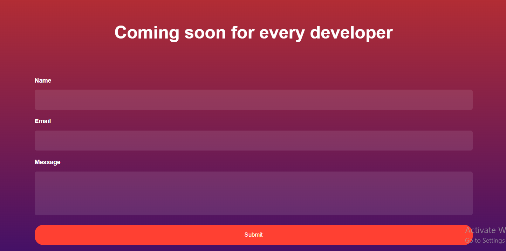

# Modern HTML CSS From The Beginning Course 🎓  
Welcome to the repository for [Modern HTML & CSS From The Beginning 2.0]! This repository contains multiple projects that demonstrate various concepts learned throughout the course.

## Table of Contents 📚  
Project 1: Pricing Card  
Project 2: Lumina Creative Website  
Project 3: Bono App  
License

---

## Project 1: Pricing Card 💳  

Live URL: [View Project 1 Live](https://pricing-card-e0e6dc.netlify.app/)
GitHub Repo: [Project 1 Repository](https://github.com/Subrina-Sirajee/HTML-CSS/tree/main/Pricing%20Card)

---

## Project 2: Lumina Creative Website 💻  

Live URL: [View Project 2 Live](https://lumina-creative-83cd5a.netlify.app/) 
GitHub Repo: [Project 2 Repository](https://github.com/Subrina-Sirajee/HTML-CSS/tree/main/Lumina%20Creative%20Website)

---

## Project 3: Bono App 🧩  

Live URL: [View Project 3 Live](https://bonoapp.netlify.app/)  
GitHub Repo: [Project 3 Repository](https://github.com/Subrina-Sirajee/HTML-CSS/tree/main/Bono%20App)

---

## License  
This repository is for educational purposes as part of the **Modern HTML & CSS** course. You are free to use the code in your personal or academic projects.
